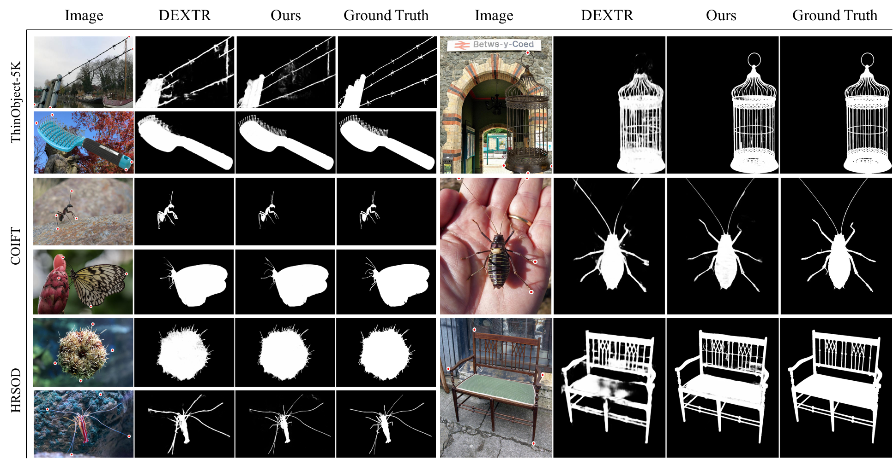
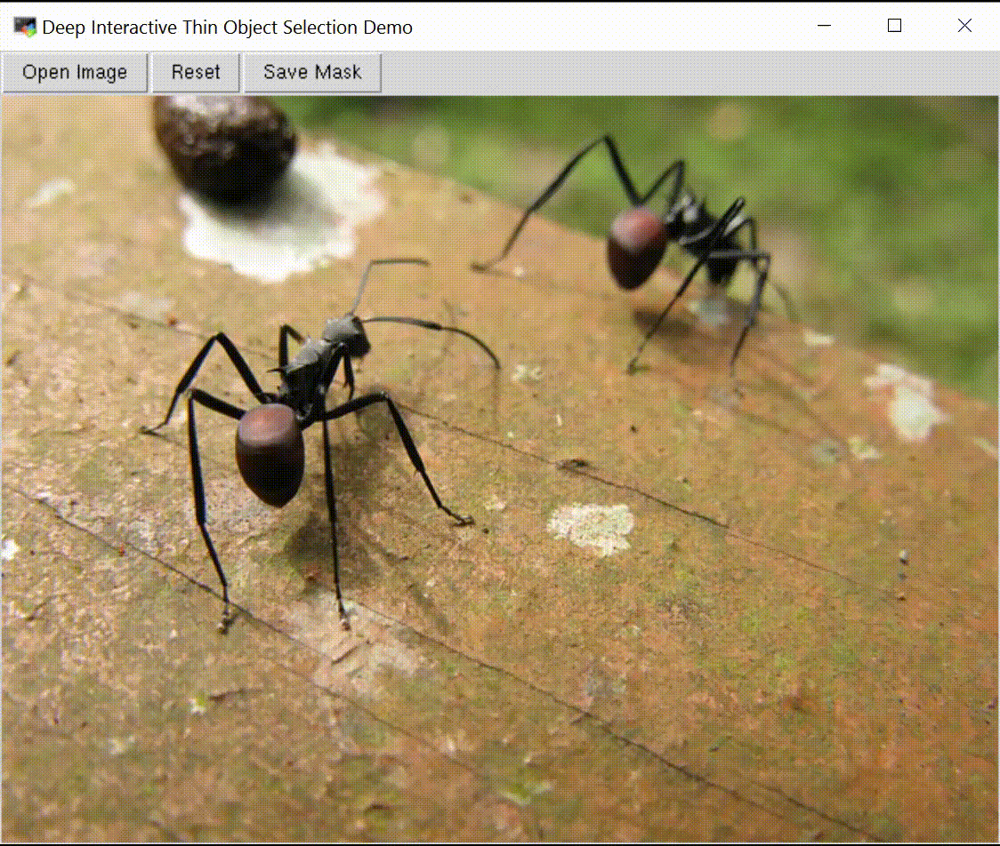

# Deep Interactive Thin Object Selection

This is the official implementation of our work `Deep Interactive Thin Object Selection`, for segmentation of object with elongated thin structures (e.g., bug legs and bicycle spokes) given extreme points (top, bottom, left-most and right-most pixels).

> **Deep Interactive Thin Object Selection**,            
> Jun Hao Liew, Scott Cohen, Brian Price, Long Mai, Jiashi Feng    
> In: Winter Conference on Applications of Computer Vision (WACV), 2021  
> [[pdf](https://openaccess.thecvf.com/content/WACV2021/html/Liew_Deep_Interactive_Thin_Object_Selection_WACV_2021_paper.html)] [[supplementary](https://openaccess.thecvf.com/content/WACV2021/supplemental/Liew_Deep_Interactive_Thin_WACV_2021_supplemental.pdf)]

Here are some example results of our method.

<!--  -->


## Installation
The code was tested with Anaconda, Python 3.7, PyTorch 1.7.1 and CUDA 10.1.

0. Clone the repo:
    ```.bash
    git clone https://github.com/liewjunhao/thin-object-selection
    cd thin-object-selection
    ```

1. Setup a virtual environment.
    ```.bash
    conda create --name tosnet python=3.7 pip
    source activate tosnet
    ```

2. Install dependencies.
    ```.bash
    conda install pytorch=1.7.1 torchvision=0.8.2 cudatoolkit=10.1 -c pytorch
    conda install opencv=3.4.2 pillow=8.0.1
    pip install scikit-fmm tqdm scikit-image gdown
    ```

3. Download the pre-trained model by running the script inside ```weights/```:
    ```.bash
    cd weights/
    chmod +x download_pretrained_tosnet.sh
    ./download_pretrained_tosnet.sh
    cd ..
    ```

4. Download the dataset by running the script inside ```data/```:
    ```.bash
    cd data/
    chmod +x download_dataset.sh
    ./download_dataset.sh
    cd ..
    ```

5. (Optional) Download the pre-computed masks by running the script inside ```results/```:
    ```.bash
    cd results/
    chmod +x download_precomputed_masks.sh
    ./download_precomputed_masks.sh
    cd ..
    ```

## Quick Start
We also provide a simple interactive demo:
```Shell
python demo.py
```
If installed correctly, the result should look like this:

<!--  -->
<p float="left">
  
  
</p>

## Training
We provide the scripts for training our models on our ThinObject-5K dataset. You can start training with the following commands:
```.bash
python train.py
```

## Testing
Datasets can be found [here](#dataset-and-pre-computed-masks). The extracted thin regions used for evaluation of IoU<sub>thin</sub> can be downloaded [here](https://drive.google.com/file/d/1EJS63xPOk04ZOihcWCIM80JulHZTTzLY/view?usp=sharing). For convenience, we also release a script file (step 4 in [Installation](#installation)) that downloads all the files needed for evaluation.  Our test script expects the following structure:

```Shell
data
├── COIFT
│   ├── images
│   ├── list
│   └── masks
├── HRSOD
│   ├── images
│   ├── list
│   └── masks
├── ThinObject5K
│   ├── images
│   ├── list
│   └── masks
└── thin_regions
    ├── coift
    │   ├── eval_mask
    │   └── gt_thin
    ├── hrsod
    │   ├── eval_mask
    │   └── gt_thin
    └── thinobject5k_test
        ├── eval_mask
        └── gt_thin
```

To evaluate, 
```.bash
# This commands runs the trained model on test set and saves the resulting masks
python test.py --test_set <test-set> --result_dir <path-to-save-dir> --cfg <config> --weight <weights>
# This commands evaluates the performance of the trained model given the saved masks
python eval.py --test_set <test-set> --result_dir <path-to-save-dir> --thres <threshold>
```
Where ```test_set``` denotes the testing dataset (currently support ```coift```, ```hrsod``` and ```thinobject5k_test```).

Examples of the script usage:
```.bash
# This command evaluates on COIFT dataset using threshold of 0.5
python test.py --test_set coift --result dir results/coift/
python eval.py --test_set coift --result_dir results/coift/ --thres 0.5

# This command evaluates on HRSOD dataset using the pre-trained model
python test.py --test_set hrsod --result_dir results/hrsod/ --cfg weights/tosnet_ours/TOSNet.txt --weights weights/tosnet_ours/models/TOSNet_epoch-49.pth
python eval.py --test_set hrsod --result_dir results/hrsod/
```

Alternatively, run the following script to perform testing and evaluation on all the 3 benchmarks:
```.bash
chmod +x scripts/eval.sh
./scripts/eval.sh
```

*** Note that the inference script (```test.py```) does not always give the same output each time (~0.01% IoU difference), even when the weights are held constant. Similar issue was also reported in this [post](https://github.com/pytorch/pytorch/issues/28197#issuecomment-544942600). User is advised to first save the masks by running ```test.py``` once before evaluating the performance using ```eval.py```.

## Dataset and Pre-computed Masks
For convenience, we also offer the pre-computed masks from our method (step 5 in [Installation](#installation)).
| Dataset               | IoU | IoU<sub>thin</sub> | F-boundary | Masks | Source |
|---|:--:|:--:|:--:|:--:|:--:|
| COIFT                 | 92.0 | 76.4 | 95.3 | [Download](https://drive.google.com/file/d/1Hgj4814fo1EGzpfXbPD9gJQI-YEQiFtS/view?usp=sharing) | [Link](https://drive.google.com/file/d/1SapWK3yX2utscH8e-cJzQivp_Qp7IBQf/view?usp=sharing) |
| HRSOD                 | 86.4 | 65.1 | 87.9 | [Download](https://drive.google.com/file/d/17NBG0BWOuK1674afTG09G5FBv0IMeflu/view?usp=sharing) | [Link](https://drive.google.com/file/d/1dLZTzQuDEuBICKtaRB03i1Mx9hOssxC4/view?usp=sharing) |
| ThinObject-5K         | 94.3 | 86.5 | 94.8 | [Download](https://drive.google.com/file/d/1Hiwi7hXFIifMis4q9YOwj1fa2K6OAHZk/view?usp=sharing) | [Link](https://drive.google.com/file/d/1yUSNCOPwbkEyrQYr5d2OtNjRMEbuQp7O/view?usp=sharing) |

## License
This project is licensed under a [Creative Commons Attribution-NonCommercial 4.0 International Public License](https://creativecommons.org/licenses/by-nc/4.0/legalcode).

## Citation
If you use this code, please consider citing our paper:

	@Inproceedings{liew2021deep,
	  Title          = {Deep Interactive Thin Object Selection},
	  Author         = {Liew, Jun Hao and Cohen, Scott and Price, Brian and Mai, Long and Feng, Jiashi},,
	  Booktitle      = {Winter Conference on Applications of Computer Vision (WACV)},
	  Year           = {2021}
	}

## Acknowledgement
This code is built upon the following projects: 
[DEXTR-PyTorch](https://github.com/scaelles/DEXTR-PyTorch), 
[DeepInteractiveSegmentation](https://github.com/MarcoForte/DeepInteractiveSegmentation), 
[davis](https://github.com/fperazzi/davis).
We thank the authors for making their codes available!
